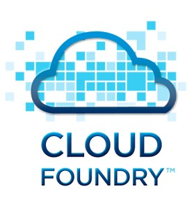
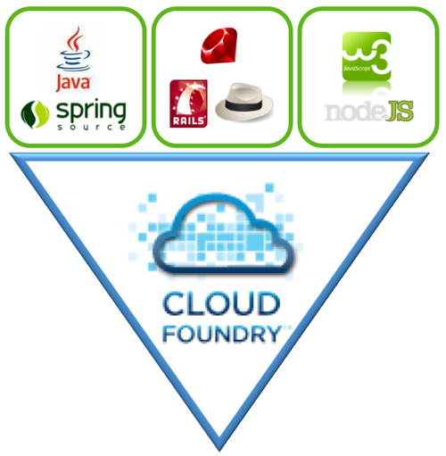

!SLIDE 

How we built our own heroku using Clound Foundry 
================================================
Belarus Ruby on Rails User Group Meetup



!SLIDE
Who am I? 
=========

* I'm @gastonramos, gramos
* Using Ruby since 2006
* I'm from Santa Fe Argentina
* Open Source contributor: Rails, Debian, Rubinius, Cloud Foundry

!SLIDE
Disclaimer 
==========

* I'm not a Cloud Foundry expert

* 1 month working with CF.

* I'm going to talk about CF v2.

* V2 is under heavy development.

!SLIDE
# What is a Paas? #

* Is a category of cloud computing services.

* Facilitate the deployment of applications. 

* Heroku, Cloud Foundry, AWS Elastic Beanstalk, Engine Yard, Google App Engine.

!SLIDE
# Ruby does not scale #
Have you heard this before? 

## :/


!SLIDE
# What is Cloud Foundry? #

Is a PaaS,

It is an open source project and is available through a variety 
of private cloud distributions and public cloud instances, 
including CloudFoundry.com.

!SLIDE
# What programming languages does Cloud Foundry support? #

Spring, Java, Rails and Sinatra for Ruby, Node.js. 
Scala and other JVM languages/frameworks including Groovy and Grails.



Buildpacks in v2. ????

!SLIDE
Why Cloud Foundry matters to hackers?
-------------------------------------


!SLIDE
Why Cloud Foundry matters to hackers?
=====================================

* It is open source. You can modify it. In fact we are doing it.

* It is well designed.

* No vendor locking. 

Cloud Foundry providers: AppFog, cloudfoundry.com, pass.io

!SLIDE
# Cloud Foundry Architectural Goals #

* No single point of failure.
* Distributed state.
* Self healing.
* Horizontally scalable.

!SLIDE
# Cloud Foundry Core Components #

Cloud Controller - Dea - Health Manager - Router - Warden - Services - Uaa

(image and very short description)

!SLIDE
# Nats #

* All the cloud foundry components communicate through nats.

* publish-subscribe messaging system.

https://github.com/derekcollison/nats

nats-sub foo &
nats-pub foo 'Hello World!'

!SLIDE

# Cloud Controller # 

* Written in Ruby awesome!

* REST API endpoints for clients 

* Maintains a database with tables for orgs, spaces, apps, 
   services, service instances, user roles, and more.

* CC

**cf** <--- http ---> **Cloud Controller** <-- Nats --> **CF components**

!SLIDE

# CC Blob Store #

The Cloud Controller manages a blob store for:

* **Resources** - files that are uploaded to the Cloud Controller with a unique SHA 
  
* **App packages** - unstaged files that represent an application
   
* **Droplets** - the result of taking an app package and staging it 
                 and getting t ready to run
	 
The blo uses **FOG** 

https://github.com/fog/fog	 

!SLIDE
# CC and Nats #

 * Instructs a DEA to stage an application 
 
 * Instructs a DEA to start or stop an application.
 
 * Receives information from the Health Manager about applications.
 
 * Subscribes to Service Gateways that advertise available services
 
 * Instructs Service Gateways to handle provisioning, unprovision, 
   bind and unbind operations for services


!SLIDE
# Droplet Execution Agent (Dea) #

* Is written in Ruby and takes care of managing an application instance's lifecycle.

* It can be instructed by the CC to start and stop application instances.

* It keeps track of all started instances, and periodically broadcasts messages about their state over NATS.

* DEA depends on **Warden** to run application instances.

!SLIDE
# CLI for Cloud Foundry #

Using this tool you can deploy and manage applications.

gem install cf

cf push my-new-app
cf help --all

!SLIDE
# How can we do to get all cloud foundry components up and running?

**v1 vs v2**

When we started working with cloud foundry was only one way to install it.
BOSH, and it was not working.

There was no way to install it, easy.

So we made it.

!SLIDE
# A big app

A big app

* We had to learn a lot. 

* Cloud Controller - Dea - Health Manager - Router - 
  Warden - Services - Uaa

* 7 git repos

!SLIDE
Code Stats
-----------

```
git ls-files | wc -l
```

* Cloud Controller: 313
* Dea: 218
* Health Manager: 42
* Warden: 249
* Uaa: 628 


!SLIDE

Code Stats
-----------

```
git ls-files | xargs cat | wc -l
```

* Cloud Controller: 36211
* Dea: 24625
* Health Manager: 5422
* Warden: 23023
* uaa: 87512
* Router: 28151

!SLIDE
# CF vagrant installer #

CF Vagrant install born

* We decided to develop an installer using the dea_ng vagrant VM,

* we added the components one by one.

* vcap-dev mailing list was our best friend.

* Lot of hacking, research and reverse engineering.

